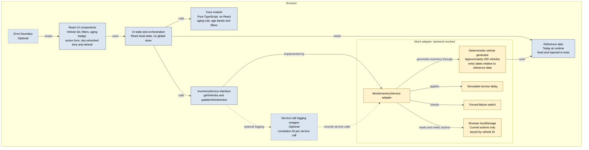
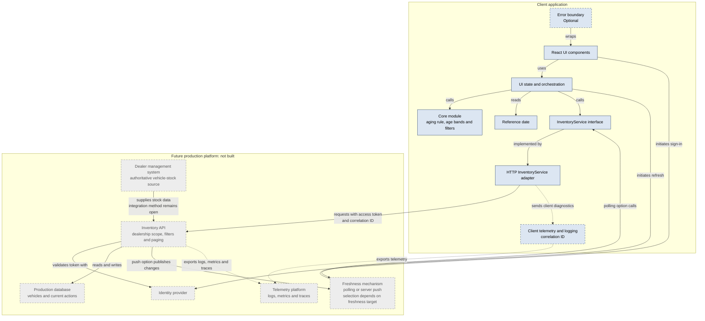

# Solution Architecture

## 1. Assessment Implementation

The assessment implements a React and TypeScript frontend with pure business logic and a mocked backend behind the `InventoryService` interface.

### Assessment component responsibilities

- **React UI components:** Present the inventory, filters, aging indicators, proposed-action workflow, refresh control and user-visible application states.
- **UI state and orchestration:** Coordinate component state, filtering, service calls, refresh behavior and action updates.
- **Core module:** Contain pure TypeScript functions for days-in-stock calculation, aging classification, age-band classification and inventory filtering.
- **Reference date:** Use the current date at runtime and an injected fixed date in automated tests.
- **InventoryService:** Define the boundary through which the frontend retrieves vehicles and updates a vehicle's current proposed action.
- **MockInventoryService:** Provide an assessment-only implementation of the service interface without a real backend.
- **Deterministic vehicle generator:** Produce approximately 200 repeatable demonstration vehicles, including required date-boundary cases.
- **Simulated delay:** Allow loading behavior to be demonstrated and tested.
- **Forced-failure switch:** Allow retrieval and save failures to be reproduced for tests and demonstration.
- **Browser localStorage:** Persist only the current proposed action for eligible vehicles during the demonstration.
- **Error boundary:** Provide optional protection against unexpected React rendering failures.
- **Service-call logging wrapper:** Provide optional diagnostic logging with a correlation ID for each service call.

### Assessment data flow

1. The user interacts with a React UI component.
2. The UI delegates state coordination to the UI state and orchestration layer.
3. The orchestration layer calls pure core functions for aging, age-band and filtering behavior.
4. The orchestration layer obtains the current reference date from the reference-date abstraction.
5. Inventory retrieval and action updates are sent through the `InventoryService` interface.
6. The assessment implementation resolves the interface through `MockInventoryService`.
7. The mock service generates deterministic inventory data, applies simulated delays and checks forced-failure settings.
8. Current proposed actions are read from and written to browser `localStorage`.
9. If optional logging is implemented, service-call information is recorded with a correlation ID.

## 2. Future Production Architecture

The future production architecture preserves the frontend service boundary while replacing the mock adapter with an HTTP adapter and production services.

### Future production changes

The future production architecture would:

- Replace `MockInventoryService` with an HTTP implementation of `InventoryService`.
- Introduce authentication and authorization through an identity provider.
- Introduce an inventory API with dealership scope, filter parameters and paging.
- Persist vehicles and actions in a production database.
- Integrate with an authoritative dealer-management or vehicle-stock system.
- Add a production telemetry platform for logs, metrics and traces.
- Introduce polling, server push or another freshness mechanism after the required freshness target is confirmed.
- Move filtering and paging to the server when production scale and performance requirements justify it.

These future components and integrations are documented for architectural completeness. They are not implemented as part of the assessment.

## 3. Architecture Boundary

### Implemented for the assessment

- React and TypeScript frontend
- UI state and orchestration
- Pure TypeScript aging, age-band and filtering logic
- Runtime and test reference-date handling
- `InventoryService` abstraction
- `MockInventoryService` adapter
- Deterministic demonstration data
- Simulated service delay
- Forced service failures
- Browser-local proposed-action persistence
- Automated unit and component tests

### Optional assessment components

The following components are implemented only if the corresponding WBS tasks remain in scope:

- React error boundary
- Service-call logging wrapper

If these components are not implemented, the system design and README must identify them as design-only considerations.

### Future production components

The following components are not built:

- HTTP service adapter
- Production inventory API
- Production database
- Identity provider integration
- Dealer-management system integration
- Multi-dealership support
- Server-side filtering and paging
- Production telemetry platform
- Polling or server-push freshness mechanism

## 4. Diagram Legend

- **Blue solid boxes:** Implemented for the assessment
- **Blue dashed boxes:** Optional assessment components
- **Yellow boxes:** Mock components used only for the assessment
- **Grey dashed boxes:** Future production components that are not built
- **Solid arrows:** Primary functional flow
- **Dotted arrows:** Optional logging, telemetry or diagnostic flow

## 5. Key Design Decisions

- Business rules remain outside React so they can be tested as pure TypeScript functions.
- React components do not directly access deterministic data or `localStorage`.
- All inventory access occurs through the `InventoryService` boundary.
- The mock adapter can be replaced without rewriting the presentation components.
- The reference date is explicit so date-sensitive tests remain deterministic.
- The assessment uses client-side filtering for its demonstration dataset.
- The future API contract introduces dealership scope, filter criteria and paging.
- Manual refresh and a visible last-refreshed time satisfy the assessment interpretation of real-time.
- Production polling or server push remains an open future design decision.