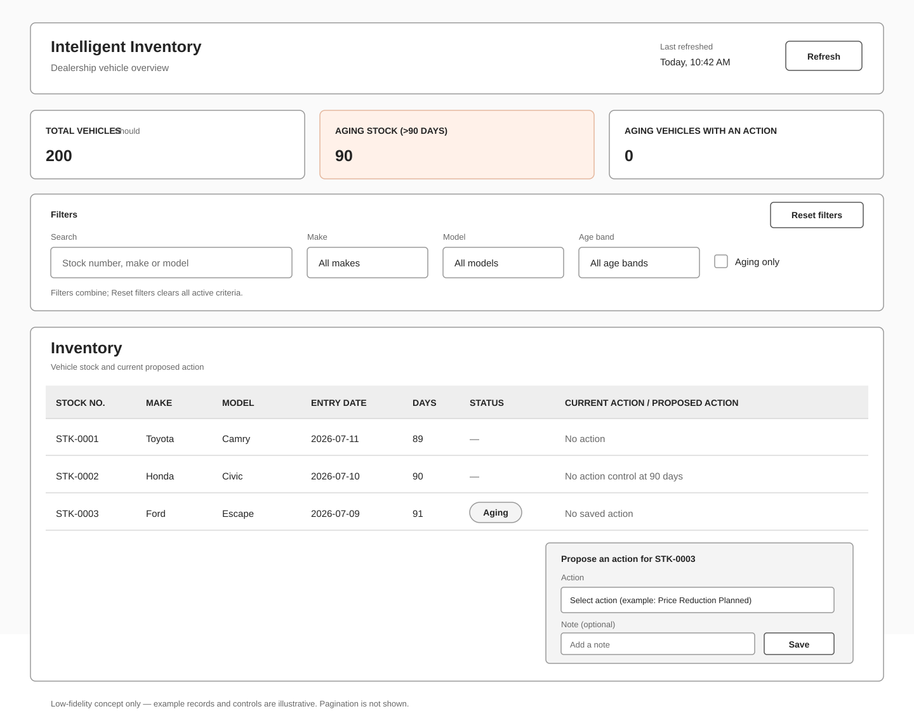

# Dashboard Wireframe

This low-fidelity SVG is a design reference for WBS 3.1. It is not an implemented screen, and its example inventory rows are illustrative.

It includes the total, aging-stock, and aging-with-action summary cards described in design choice C-14. The total-vehicle card is a Should-level element; it can be dropped if needed. The Reset filters control represents acceptance criterion AC-R1-09. Pagination is not shown because it is not part of the approved requirements.

The action selector is a conceptual interaction. It does not define the final action list or add requirements beyond the approved baseline.
